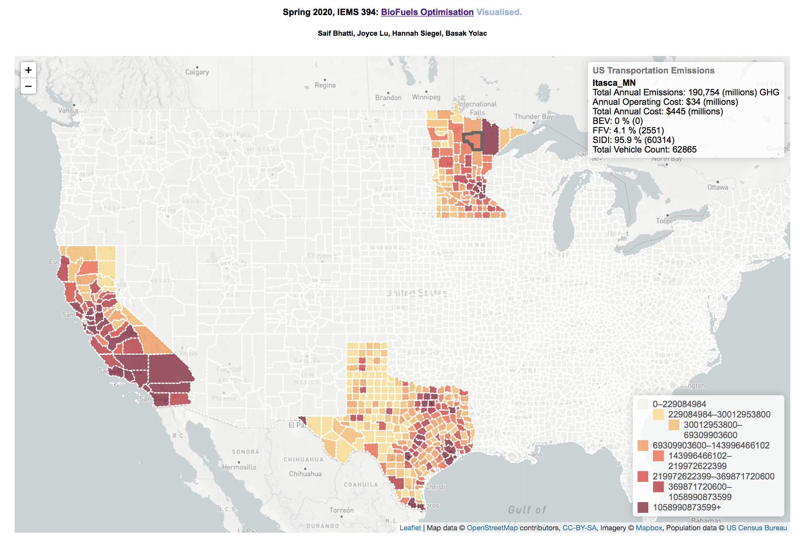
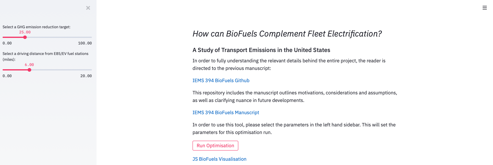

## BioFuels Optimisation Model
#### Streamlit Visualisation Tool

An online version of this visualisation (with a GHG reduction target of 25% and a 6 mile radius for each EV/E85 station) is [available here](http://www.saifbhatti.com/iems394).


<p align="center">
  
</p>

---------------
#### IEMS 394 Data Process

##### Streamlit Application

<p align="center">
  
</p>


##### Using the Model

In order to utilise the Biofuels Model, follow these steps:

1. Git clone this repository using `git clone https://github.com/saif1457/biofuels.git`. This will download the entire repository. Alternatively, use the `Download ZIP file` functionality.
2. Install all dependencies using pip3 using ` pip3 install -r requirements.txt`. This will import all dependencies required to run the files. 
3. Spin up the Streamlit application using `streamlit run publish.py`. Streamlit applications allow for UI features to change parameters.
4. Run first cells including imports, then change input to parameters as desired, and then run all cells. The notebook will automagically run the following: 
-  preprocessing (`preprocessing.py` file , runtime ranging from 0.1s to 4 minutes depending on user inputs), 
- optimisation model (`optimisation.py` file, runtime ~15 seconds),
- post-processing (`postprocessing.py` file, runtime ~20 seconds), which updates the JavaScript visualisation and it can be opened in a new tab.

##### Endnote: 
Overall run time ranges from under a minute to 6 minutes depending on the user choices for parameters mentioned above. However, the preprocessing file stores all results from computations into `preprocessed_data/pickles` and will reload from memory if the same user choices are selected, speeding up overall process significantly. Streamlit applications also cache results, which also improves run time.

---------------
#### File Stucture

```bash
├── README.md
├── publish.py
├── preprocessing.py
├── optimisation.py
├── postprocessing.py
```

<details>
  <summary>Click to view entire file structure</summary>
  
  ```bash
├── vdf
├── efuels_vi.csv
├── e85_vi.csv
├── biofuels.html
├── proposal.png
├── requirements.txt
└── state_output.js
│   ├── B(r).csv
│   ├── C(F).csv
│   ├── CC(v,s).csv
│   ├── CG(F).csv
│   ├── E.csv
│   ├── EF(f,s).csv
│   ├── F.csv
│   ├── FE(v,f).csv
│   ├── M.csv
│   ├── N(r).csv
│   ├── R.csv
│   ├── S.csv
│   ├── T(r).csv
│   ├── TM(f,s).csv
│   ├── V.csv
│   ├── W(s).csv
│   ├── W_county_param.csv
│   ├── county_renaming_engine.csv
│   ├── e85_vi.csv
│   ├── efuels_vi.csv
│   └── visual_df.csv
├── preprocessed_data
│   ├── california_car_data.csv
│   ├── counties.csv
│   ├── e85_fuel_stations.csv
│   ├── electric_fuel_stations.csv
│   ├── gz_2010_us_050_00_500k
│   │   ├── gz_2010_us_050_00_500k.dbf
│   │   ├── gz_2010_us_050_00_500k.prj
│   │   ├── gz_2010_us_050_00_500k.shp
│   │   ├── gz_2010_us_050_00_500k.shx
│   │   └── gz_2010_us_050_00_500k.xml
│   ├── gz_2010_us_050_00_500k.shp
│   ├── pickles
│   │   ├── e85_vi_6.pkl
│   │   ├── e85_vi_7.pkl
│   │   ├── e85_vi_8.pkl
│   │   ├── e85_vi_9.pkl
│   │   ├── efuels_vi_6.pkl
│   │   ├── efuels_vi_7.pkl
│   │   ├── efuels_vi_8.pkl
│   │   └── efuels_vi_9.pkl
│   ├── us_counties_2010.json
│   ├── uszips.csv
│   └── vehicle_reg
│       ├── mn_ev_registrations_public.csv
│       ├── mn_ev_registrations_public.xlsx
│       ├── tx_ev_registrations_public.csv
│       └── tx_ev_registrations_public.xlsx
```
 
</details>

All files are available both as `*.ipynb` and as `*.py` files. The Python specific scripts are for use specifically with the `394combo.ipynb` file. 

#### Technical Support / Credits
* Saif Bhatti, [saifbhatti@u.northwestern.edu](mailto:saifbhatti@u.northwestern.edu)
- Summer Research -> September 2020

##### Historical
* Joyce Lu, [joycelu2021@u.northwestern.edu](mailto:joycelu2021@u.northwestern.edu)
* Hannah Siegel, [hannahsiegel2021@u.northwestern.edu](mailto:hannahseigel2021@u.northwestern.edu)
* Basak Yolac, [basakyolac2021@u.northwestern.edu](mailto:basakyolac2021@u.northwestern.edu)
BioFuels Team - IEMS 394, Spring 2020 <br>
Professor Jill Wilson, Professor Barry Nelson <br>
**Northwestern University** <br>

<p align="center">
  
</p>
